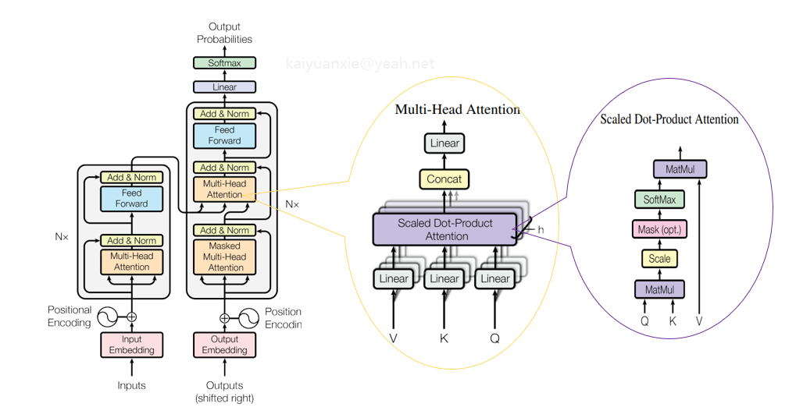

# MFU计算器

[mfu_calculation](mfu_calculation.ipynb)里面给出了简化版本的moe计算器，
调整参数计算训练模型的MFU，可以在线运行。


[mfu_detail](./mfu_detail.ipynb) 给出了计算器搭建的详解。 

# 内容：

主要介绍LLM（GPT/Llama/MoE）中一些操作层、模块的flops计算量，帮助理解MFU计算过程。



# 基本模块flops计算
## 线性层的计算量

线性层的计算公式为 Y = wX + b 涉及到矩阵的乘法与加法运算。

矩阵乘法与加法的flops的计算为：

**乘法计算量**：对于两个矩阵A和B的乘法C=AB，其中A是m×n矩阵，B是n×p矩阵，C是m×p矩阵。每个元素Cij需要进行 n 次乘法和n-1次加法，总共有mp个元素，因此总FLOPS为：

mp(n+(n-1)) = 2mnp - mp。

**加法/减法计算量**：对于两个矩阵A和B的加法C=A+B，其中A和B都是m×n矩阵，C也是m×n矩阵。每个元素Cij需要进行一次加法，总共有mn个元素，因此总FLOPS为mn。

对于linear计算，里面涉及一个矩阵乘和一个矩阵加法，由于元素需要展平再运算，权重w的维度[m, n] 输入的维度是[1, n] 输出维度[1, m]，其计算量为

2mn

不考虑bias的计算量为

2mn  - m

对于transformer的线性层输入与输出一般用相同的大小，形状都为：[batch_size, seq_len, d_model],
线性层的创建一般使用 Linear(hidden_size, hidden_size, bias=False)
所以计算量为：

flops = 2 * batch_size * seq_len * hidden_size * hidden_size

如果不一致时：
flops = 2 * batch_size * seq_len * size_1 * size_2

```
def calcu_linear_flops(batch_size, seq_len, hidden_size, head=0, d_model=0,bias=False):
    bias_flops = 0 if not bias else batch_size * seq_len * hidden_size
    if head ==0:
        flops = 2 * batch_size * seq_len * hidden_size * hidden_size + bias_flops
    else:
        flops = 2 * batch_size * seq_len * hidden_size * head * d_model + bias_flops
    return flops

```

## Attention模块的计算

一般的MHA(MultiHeadAttention)计算的构造如下：

```
class Attention(nn.Module):
    def __init__(self, input_dim, output_dim):
        super().__init__()
        self.query = nn.Linear(input_dim, output_dim)
        self.key = nn.Linear(input_dim, output_dim)
        self.value = nn.Linear(input_dim, output_dim)
        self.dk = output_dim

    # Scaled dot-product attention:
    def self_attention(self, query, key, value, mask):
        # query/key/value:  (bs,  seq_len, dk)/(bs, heads, seq_len, dk)
        # mask shape = (bs, 1, seq_len)/(bs, 1, 1, seq_len)
        scores = torch.matmul(query, key.transpose(-2, -1)) / torch.sqrt(torch.tensor(self.dk)) # (bs, seq_len, seq_len)/(bs, heads, seq_len, seq_len)
        if mask is not None:
            scores.masked_fill_(mask == torch.tensor(False), float("-inf"))
        # Softmax dim=-1 stands for apply the softmax along the last dimension
        attention_weights = nn.Softmax(dim=-1)(scores)  # (bs, heads, seq_len, seq_len)/(bs, seq_len, seq_len)
        attention_qkv = torch.matmul(attention_weights, value)   # (bs, seq_len, dk)/(bs, heads, seq_len, dk)
        return attention_qkv

    def forward(self, query, key, value, mask):
        # qkv shape: (bs, seq_len, d_model)
        query = self.query(query)
        key = self.key(key)
        value = self.value(value)
        attention_qkv = self.self_attention(query, key, value, mask)  # shape:  (bs, seq_len, d_model)
        return attention_qkv

class MultiHeadedAttention(Attention):
    def __init__(self, d_model, heads):
        super().__init__(d_model, d_model)
        assert d_model % heads == 0
        self.dk = d_model // heads  # head dimension
        self.heads = heads
        self.out_linear = nn.Linear(d_model, d_model)
        self.sqrt_dk = torch.sqrt(torch.tensor(self.dk))

    def forward(self, query, key, value, mask):
        batch_size = query.shape[0]
        # qkv shape: (bs, seq_len, dk*heads)
        # dk * heads = d_model
        query = self.query(query).view(batch_size, -1, self.heads, self.dk).transpose(1, 2)
        key = self.key(key).view(batch_size, -1, self.heads, self.dk).transpose(1, 2)
        value = self.value(value).view(batch_size, -1, self.heads, self.dk).transpose(1, 2)
        attention_qkv = self.self_attention(query, key, value, mask)  # shape:  (bs, heads, seq_len, dk)
        #  (bs, heads, seq_len, dk) -> (bs, seq_len, dk*heads)
        reshaped = attention_qkv.transpose(1, 2).reshape(batch_size, -1, self.heads * self.dk)
        representations_batch = self.out_linear(reshaped)
        return representations_batch
```

主要运算：
* Q/K/V: 线性映射
* scores: QK乘法运算
* attention_qkv: V和attention_weights乘法运算
* out_linear: 线性度计算

次要运算：
* softmax计算
* masked_fill计算

对于主要运算中有个需要考虑点：
* Attention的变化：query_attention的计算KV的heads数量与Q的heads数量不一致。
* 序列并行（context parallel/ring attention）: 考虑并行度。

次要运算在估算flops时通常可以忽略，这里例出其计算方式：

softmax的flops计算量： 输入的shape：(bs, heads, seq_len, seq_len)
元素计算涉及指数运算、加法运算、除法运算。计算量：

   3 * bs * heads * seq_len * (seq_len - 1)

maked_fill是一个掩模操作包含：判断操作和赋值操作，假设是需要遍历整个矩阵，每个元素操作一次，而赋值操作仅对需要操作的元素赋值，输入矩阵的大小为[bs, heads, seq_len, seq_len], 操作的个数为X。所以计算量：

   bs * heads *  seq_len * seq_len + X

由于X操作相对来说较小, 公式简化为：

   bs * heads *  seq_len * seq_len

```
def calcu_attention_flops(batch_size, seq_len, heads, d_model, num_query_groups=0, context_parallel=1):
    num_query_groups = num_query_groups if num_query_groups != 0 else heads
    q_linear_flops = calcu_linear_flops(batch_size, seq_len, heads * d_model)
    k_linear_flops = calcu_linear_flops(batch_size, seq_len, heads * d_model, num_query_groups, d_model)
    v_linear_flops = k_linear_flops

    kv_scores_flops = 2 * batch_size * seq_len**2 * heads * d_model * (context_parallel + 1) / (2 * context_parallel)
    mask_flops = batch_size * heads *  seq_len * seq_len
    softmax_flops = 3 * batch_size * heads * seq_len * (seq_len - 1)

    qkv_flops = kv_scores_flops
    out_linear_flops = calcu_linear_flops(batch_size, seq_len, heads * d_model)
    return q_linear_flops + k_linear_flops + v_linear_flops + kv_scores_flops + mask_flops + softmax_flops + qkv_flops + out_linear_flops

```

## LayerNorm/RMSNorm

Layer_norm的计算内容一般如下：

```
import numpy as np

def layer_normalization(x, epsilon=1e-8):
    mean = np.mean(x, axis=-1, keepdims=True) # 最后一个维度
    std = np.std(x, axis=-1, keepdims=True)
    normalized_x = (x - mean) / (std + epsilon)
    return normalized_x

```
假设数据的长度为L
包含平均值计算、标准差计算、偏移计算；
* mean计算包含L加法和一次除法：  L + 1
* std计算，每个元素进行一个减法、一个乘法、一个加法。最后进行一个除法和一个乘法操作： 3*L + 2
* 标准化：每个元素一次减法、一次除法操作： 2*L

忽略单次运算，所以操作计算量：

6 * batch_size * seq_len * hidden_size

```
def calcu_layer_norm_flops(batch_size, seq_len, hidden_size):
  return 6 * batch_size * seq_len * hidden_size

```

RMSNorm 常见的代码实现如下：

```
# 参考Llama定义
class LlamaRMSNorm(nn.Module):
    def __init__(self, hidden_size, eps=1e-6):
        '''
        LlamaRMSNorm is equivalent to T5LayerNorm
        '''
        super().__init__()
        self.weight = nn.Parameter(torch.ones(hidden_size))
        self.variance_epsilon = eps

    def forward(self, hidden_states):
        input_dtype = hidden_states.dtype
        hidden_states = hidden_states.to(torch.float32)
        variance = hidden_states.pow(2).mean(-1, keepdim=True)
        hidden_states = hidden_states * torch.rsqrt(variance + self.variance_epsilon)
        return self.weight * hidden_states.to(input_dtype)
```

主要计算内容：
* 元素二次方、元素求平均（n-1）、一个rsqrt运算、一个求和运算
* 两个乘法操作

忽略单次运算，flops数等于：

  4 * batch_size * seq_len * hidden_size

```
def calcu_rmsnorm_flops(batch_size, seq_len, hidden_size):
  return 4 * batch_size * seq_len * hidden_size

```

## MLP/FFN层的计算

MLP层的构建常见的方式如下：

```
class PositionwiseFeedForward(nn.Module):
    def __init__(self, d_model, dff=2048):
        super().__init__()
        self.linear1 = nn.Linear(d_model, dff)
        self.linear2 = nn.Linear(dff, d_model)
        self.relu = nn.ReLU()

    def forward(self, representations_batch):
        return self.linear2(self.relu(self.linear1(representations_batch)))
```

主要包含两个线性层操作和一个Relu计算。

输入/输出: [batch_size, seq_len, hidden_size]
dff值：ffn_hidden_size

计算量为两次线性运算 + 一个relu操作，其flops操作数量如下：
2 * batch_size * seq_len * hidden_size * ffn_hidden_size + batch_size * seq_len * ffn_hidden_size

Llama的MLP有些改动，一般的计算包含三次线性运算（gate_proj、up_proj、down_proj, 参看hugging face的LlamaMLP定义）一个silu运算，一个元素乘法运算。

[LlamaMLP定义](https://github.com/huggingface/transformers/blob/v4.48.0/src/transformers/models/llama/modeling_llama.py#L174):


```
# L174
class LlamaMLP(nn.Module):
    def __init__(self, config):
        super().__init__()
        self.config = config
        self.hidden_size = config.hidden_size
        self.intermediate_size = config.intermediate_size
        self.gate_proj = nn.Linear(self.hidden_size, self.intermediate_size, bias=config.mlp_bias)
        self.up_proj = nn.Linear(self.hidden_size, self.intermediate_size, bias=config.mlp_bias)
        self.down_proj = nn.Linear(self.intermediate_size, self.hidden_size, bias=config.mlp_bias)
        self.act_fn = ACT2FN[config.hidden_act]
        
    def forward(self, x):
        down_proj = self.down_proj(self.act_fn(self.gate_proj(x)) * self.up_proj(x))
        return down_proj
```

对应的flops计算工作：

3 * batch_size * seq_len * hidden_size * ffn_hidden_size + 2 * batch_size * seq_len * ffn_hidden_size


```
def calcu_mlp_flops(batch_size, seq_len, hidden_size, ffn_hidden_size, use_gate=True):
  """
   use_gate=True SwiGLU structure FFN.
  """
  if use_gate:
    flops = 3 * 2 * batch_size * seq_len * hidden_size * ffn_hidden_size + 2 * batch_size * seq_len * ffn_hidden_size
  else:
    flops = 2 * 2 * batch_size * seq_len * hidden_size * ffn_hidden_size + batch_size * seq_len * ffn_hidden_size
  return flops

```

## Logits计算

logits计算包含三个运算：

* layernorm
* linaer，(词表映射)
* softmax

对应尺寸
* layernorm/rmsnorm: [batch_size, seq_len, hidden_size]
* linear: input:[batch_size，seq_len*hidden_size] output: :[batch_size，seq_len*vocab_size]
* softmax: [batch_size，seq_len*vocab_size]

对应计算量：

6 * batch_size * seq_len * hidden_size

batch_size * seq_len * hidden_size * vocab_size

3 * batch_size * seq_len * (vocab_size - 1)

```
def calcu_logits_flops(batch_size, seq_len, heads, d_model, hidden_size, vocab_size, RMSNorm=True):
    norm_flops = calcu_rmsnorm_flops(batch_size, seq_len, hidden_size) if RMSNorm else \
    calcu_layer_norm_flops(batch_size, seq_len, hidden_size)

    linear_flops = 2 * batch_size * seq_len * hidden_size * vocab_size

    softmax_flos = 3 * batch_size * seq_len * (vocab_size - 1)
    return norm_flops + linear_flops + softmax_flos

```

## 位置编码计算

Transformer采用的位置编码PE：包含正弦/余弦运算，对每个位置进行d_model/2正弦,d_model/2余弦，计算量为：

seq_len * d_model

注：如果进行了多头切分， d_model = d_model * heads

如果采用旋转位置编码RoPE：

* 旋转角度计算：d_model
* 每个位置计算构造旋转矩阵：seq_len * d_model
* Q,K与旋转矩阵乘法：4 * batch_size * seq_len * d_model


```
def calcu_position_encoding(batch_size, seq_len, heads, d_model, pe_type="rope"):
  if pe_type == "rope":
    return 4 * batch_size * seq_len * d_model * heads
  else:
    return seq_len * d_model * heads

```

## Router计算

router计算主要是在MoE中应用，其计算一般包括：

```
self.gate = nn.Linear(config.hidden_size, config.num_experts, bias=False)
hidden_states = hidden_states.view(-1, hidden_dim)
# router_logits: (batch * sequence_length, n_experts)
router_logits = self.gate(hidden_states)

routing_weights = F.softmax(router_logits, dim=1, dtype=torch.float)
routing_weights, selected_experts = torch.topk(routing_weights, self.top_k, dim=-1)
```
主要是一个gate线性层计算：

flops = 2 * batch_size * seq_len * hidden_size * num_experts

```
def calcu_router_flops(batch_size, seq_len, hidden_size, experts):
  return 2 * batch_size * seq_len * hidden_size * experts

```

# 典型训练模型的flops计算

训练估算约定:

1、模型backward计算是forward计算大约两倍, 因为需要计算输入 + 权重的梯度 [参考](https://arxiv.org/pdf/2205.05198)。

2、输入的Embedding层主要完成映射计算, 输入维度[batch_size, seq_len] 输出维度： (bs, seq_len, d_model)，其flops计算量可以忽略。 其权重用于LM-head计算时对应的计算量在logits中考虑。


3、位置编码的计算量相对较小，给与忽略。

## GPT结构flops计算

模型涉及计算的主要结构

decoder_layer x N + logtis

其中L是层数，decoder构成：

MHA + FFN + 2 LayerNorm


```
def caclu_gpt_flops(batch_size, seq_len, heads, d_model, hidden_size, vocab_size, ffn_hidden_size, layer_nums):
  attention_flops = calcu_attention_flops(batch_size, seq_len, heads, d_model, num_query_groups=0, context_parallel=1)
  ffn_flops = calcu_mlp_flops(batch_size, seq_len, hidden_size, ffn_hidden_size, use_gate=False)
  layer_norm_flops = calcu_layer_norm_flops(batch_size, seq_len, hidden_size)
  logits_flops = calcu_logits_flops(batch_size, seq_len, heads, d_model, hidden_size, vocab_size, False)
  return 3 * (logits_flops + (layer_norm_flops * 2 + attention_flops + ffn_flops) * layer_nums)

```

## LLAMA结构flops计算

结构：

(GMQA + FFN + RMSNorm) x L + logtis

其中GMQA 是group attention， FFN： Feed ForwardSwiGLU结构。


```
def caclu_llama_flops(batch_size, seq_len, heads, d_model, hidden_size, vocab_size, ffn_hidden_size, layer_nums, num_query_groups):
  attention_flops = calcu_attention_flops(batch_size, seq_len, heads, d_model, num_query_groups=num_query_groups, context_parallel=1)
  ffn_flops = calcu_mlp_flops(batch_size, seq_len, hidden_size, ffn_hidden_size, use_gate=True)
  layer_norm_flops = calcu_layer_norm_flops(batch_size, seq_len, hidden_size)
  logits_flops = calcu_logits_flops(batch_size, seq_len, heads, d_model, hidden_size, vocab_size)
  return 3 * (logits_flops + (layer_norm_flops * 2 + attention_flops + ffn_flops) * layer_nums)

```

## MoE模型flops计算

在llama结构基础上ffn增加topk专家数量系数，计算公式：

(GMQA + FFN * Experts_topk + Router + RMSNorm) x L + logtis


```
def caclu_moe_flops(batch_size, seq_len, heads, d_model, hidden_size, vocab_size, ffn_hidden_size, layer_nums, num_query_groups, topk, experts):
  attention_flops = calcu_attention_flops(batch_size, seq_len, heads, d_model, num_query_groups=num_query_groups, context_parallel=1)
  ffn_flops = calcu_mlp_flops(batch_size, seq_len, hidden_size, ffn_hidden_size, use_gate=True)
  layer_norm_flops = calcu_layer_norm_flops(batch_size, seq_len, hidden_size)
  logits_flops = calcu_logits_flops(batch_size, seq_len, heads, d_model, hidden_size, vocab_size)
  router_flops = calcu_router_flops(batch_size, seq_len, hidden_size, experts)
  return 3 * (logits_flops + (layer_norm_flops * 2 + attention_flops + ffn_flops * topk + router_flops) * layer_nums)

```

MoE如果包括了共享专家(shared experts)，上述计算公式中将topk的数量设置为：

topk + shared_experts_nums

# MFU计算

MFU(Model Flops Utilization)计算的公式为：

MFU = 单位时间实际flops/单位时间名义flops

单位时间实际flops = 单步模型计算flops总数/单步迭代时间

MFU = model_flops_sum / iter_time * (device_peak_flops * device_num)

通常device_peak_flops的单位为： TFlops/s
```
def calcu_moe_mfu(iter_time, batch_size, seq_len, heads, d_model, hidden_size, vocab_size, ffn_hidden_size, layer_nums, num_query_groups, topk, experts, device_nums, device_peak_flops):
    model_flops = caclu_moe_flops(batch_size, seq_len, heads, d_model, hidden_size, vocab_size, ffn_hidden_size, layer_nums, num_query_groups, topk, experts)
    return model_flops / (iter_time * device_peak_flops * device_nums * 10 ** 12)
```
测试：
```
calcu_moe_mfu(iter_time=1.5,
       batch_size=1024, seq_len=4096, heads=8, d_model=128,
       hidden_size=1024, vocab_size=32768, ffn_hidden_size=2048,
       layer_nums=100, num_query_groups=4, topk=9, experts=100,
       device_nums=1024, device_peak_flops=280)
```

# 参考内容：

https://zhuanlan.zhihu.com/p/691126108

https://github.com/naklecha/llama3-from-scratch/blob/main/README.md

https://arxiv.org/pdf/2205.05198

https://docs.nvidia.com/deeplearning/transformer-engine/user-guide/examples/te_llama/tutorial_accelerate_hf_llama_with_te.html

https://github.com/huggingface/transformers/blob/v4.48.0/src/transformers/models/qwen2_moe/modeling_qwen2_moe.py#L603

https://bbycroft.net/llm